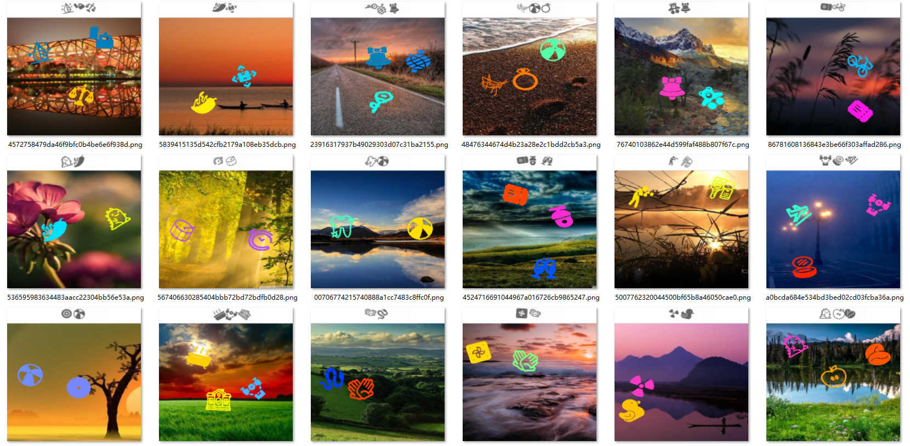
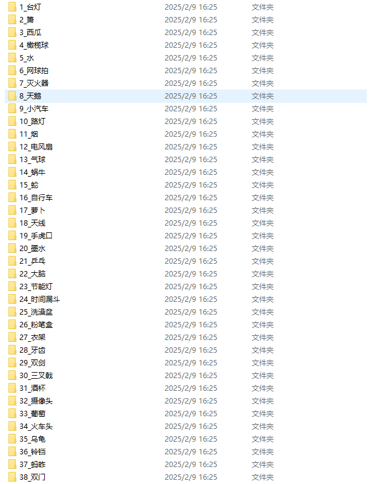
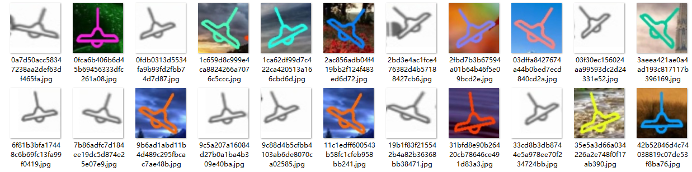

# 声明：本教程只能用于教学目的，如果用于非法目的与本人无关

# --------------- 广告 ---------------
## 本人24个实战视频教程，后续会更新十几个，每个教程都有配套的数据样本，训练代码，成品模型，推测代码，2k出售，有问题可以随时问，详情联系本人：tomysky67


## 试看视频 顶象空间推理.mkv 链接: https://pan.baidu.com/s/1ly-wmD5GMHpwTb2PpF8-ww?pwd=6666 提取码: 6666
# --------------- 广告 ---------------

# 图标点选yolo+resnet

视频讲解地址：
## 1.分析



> ​		要根据上面的提示的图标顺序，点击下面的对应的图标。还是先做目标检测，只不过上面的提示图标和下面的有背景的图标都需要做检测；然后把检测到的图标分割为小图标做分类；最后把检测模型和分类模型组合到一起使用得出结果。

## 2.目标检测

> ​	把上面的图标和下面的图标都做检测，不过需要分为两类，上面指定为text类，下面指定为target类，方便后续进行处理。

**target.yaml**

```yaml
train: train/images # train images (relative to 'path') 128 images
val: val/images # val images (relative to 'path') 128 images

nc: 2
names: ["text","target"]

```

**train.py**

```python
from ultralytics import YOLO

def train_model():
    # 加载YOLOv8模型
    model = YOLO('yolo11m.pt')  
    # 开始训练
    model.train(
        data='./target.yaml',  # 数据集的配置文件
        epochs=600,                        # 训练的轮数
        imgsz=640,                         # 输入图像的尺寸
        batch=16,                          # 批处理大小
        device='0',                        # 使用的GPU设备编号
        patience=600
          )

    # 评估模型
    model.val()

    # 导出模型
    model.export(format='onnx')  # 你可以选择其他格式，如'onnx', 'coreml', 'tflite', 等等

if __name__ == '__main__':
    import multiprocessing
    multiprocessing.freeze_support()  # 确保在Windows系统上正确启动多进程
    train_model()
```

## 3.分类训练

> ​	第一步需要分割小图标，上面的提示小图标和下面的有背景的小图标都分割到一起，然后进行分类。

**分割代码：**

```python
# -*- coding: utf-8 -*-
import os
from ultralytics import YOLO
import cv2

num = 0
# 加载 ONNX 模型
model = YOLO('best.pt')

def resize_save_image(image,new_path):
    # 调整大小
    new_image = cv2.resize(image,(128,128))

    # 保存到新的路径
    cv2.imwrite(new_path,new_image)

def predict_and_draw_boxes(image_path):
    global num
    # 读取图像
    image = cv2.imread(image_path)
    image = cv2.resize(image,(640,640))
    if image is None:
        print(f"Error: Image at {image_path} could not be loaded.")
        return

    # 进行预测
    results = model(image)

    # 解析和显示结果
    boxes = results[0].boxes.xyxy  # 获取所有预测框的坐标
    classes = results[0].boxes.cls  # 获取所有预测框的类别
    confidences = results[0].boxes.conf  # 获取所有预测框的置信度
    for i, box in enumerate(boxes):
        x1, y1, x2, y2 = map(int, box)  # 转换为整数坐标

        class_id = int(classes[i].item())  # 类别ID
        confidence = confidences[i].item()
        if confidence<0.7:
            continue
        cropped_img = image[y1:y2, x1:x2]
        new_path = "splited_images/{}.jpg".format(str(num))
        num += 1
        resize_save_image(cropped_img,new_path)


if __name__ == '__main__':
    base_dir = r""
    files = os.listdir(base_dir)
    for index,file in enumerate(files):
        file = base_dir + "/"+file
        print("No {} file:{}".format(str(index),file))
        predict_and_draw_boxes(file)


```

> ​	分割好了之后对图标进行手动或者半自动的分类，分好的效果如下：





> ​	这时候就可以进行分类训练了，代码如下：

**classify_train.py**

```python
import os.path

import torch
from torch import nn
import torchvision.transforms as T
import torch.utils.data.dataset
from torchvision import datasets
from torchvision import models
from torch.optim.lr_scheduler import ReduceLROnPlateau, StepLR
from tqdm import tqdm
import time
from torch.utils.data import DataLoader, random_split

DEVICE = torch.device('cuda:0' if torch.cuda.is_available() else 'cpu')  # 检查是否有可用的GPU


transform=T.Compose([
            T.Resize((128, 128)),
            T.ToTensor(),
            T.Normalize([0.485, 0.456, 0.406], [0.229, 0.224, 0.225])
        ])
# 加载整个数据集
dataset = datasets.ImageFolder(root=r'./classify_images', transform=transform)


# 划分数据集为训练集和验证集
def split_dataset(dataset, train_ratio=0.9):
    # 计算训练集和验证集的大小
    total_size = len(dataset)
    train_size = int(total_size * train_ratio)
    val_size = total_size - train_size
    # 使用 random_split 划分数据集
    train_dataset, val_dataset = random_split(dataset, [train_size, val_size])
    return train_dataset, val_dataset


def train():
    BATCH_SIZE = 100  # 调整批量大小
    CAPTCHA_CHARS = dataset.classes
    print("CAPTCHA_CHARS:", CAPTCHA_CHARS)
    CAPTCHA_CHARS = len(CAPTCHA_CHARS)
    train_dataset, val_dataset = split_dataset(dataset)
    train_loader = DataLoader(train_dataset, batch_size=BATCH_SIZE, shuffle=True, num_workers=4)
    val_loader = DataLoader(val_dataset, batch_size=BATCH_SIZE//2, shuffle=False, num_workers=2)

    # model = models.resnet18(pretrained=True)
    # model = models.resnet50(pretrained=True)
    model = models.resnet101(pretrained=True)

    num_ftrs = model.fc.in_features
    model.fc = nn.Linear(num_ftrs, CAPTCHA_CHARS)
    model = model.to(DEVICE)

    # 使用 Adam 优化器
    # optimizer = torch.optim.Adam(model.parameters(), lr=0.01)
    # optimizer = torch.optim.AdamW(model.parameters(), lr=0.01, weight_decay=0.001)
    optimizer = torch.optim.SGD(model.parameters(), lr=0.01, momentum=0.9, weight_decay=0.001)

    loss_func = nn.CrossEntropyLoss()

    # 学习率调度器（StepLR）
    # scheduler = ReduceLROnPlateau(optimizer, mode='min', patience=3, factor=0.5, min_lr=0.00001)
    scheduler = StepLR(optimizer, step_size=7, gamma=0.1) #(学习效果好点)
    # scheduler = CosineAnnealingLR(optimizer, T_max=20, eta_min=1e-5)  # 使用Cosine Annealing学习率调度

    start_epoch = 0
    best_acc = 0.0  # 用于保存最好的验证准确率
    model_path = "models"
    if not os.path.exists(model_path):
        os.mkdir(model_path)
    for epoch in range(start_epoch, 300):  # 减少训练次数观察效果
        start = time.time()
        # Train
        model.train()
        train_loss = 0.0
        correct_train = 0
        total_train = 0
        bar = tqdm(train_loader)
        for x, label in bar:
            x, label = x.to(DEVICE), label.to(DEVICE)
            out = model(x)
            loss = loss_func(out, label)

            optimizer.zero_grad()
            loss.backward()
            optimizer.step()

            train_loss += loss.item()
            _, predicted = torch.max(out.data, 1)
            total_train += label.size(0)
            correct_train += (predicted == label).sum().item()

            lr = optimizer.param_groups[0]['lr']
            bar.set_description("Train epoch %d, loss %.4f, acc %.4f, lr %.6f" % (
                epoch, train_loss / total_train, correct_train / total_train, lr
            ))

        # Valid
        model.eval()
        valid_loss = 0.0
        correct_valid = 0
        total_valid = 0
        bar = tqdm(val_loader)
        with torch.no_grad():
            for x, label in bar:
                x, label = x.to(DEVICE), label.to(DEVICE)
                out = model(x)
                loss = loss_func(out, label)

                valid_loss += loss.item()
                _, predicted = torch.max(out.data, 1)
                total_valid += label.size(0)
                correct_valid += (predicted == label).sum().item()

                lr = optimizer.param_groups[0]['lr']
                bar.set_description("Eval epoch %d, loss %.4f, acc %.4f, lr %.6f" % (
                    epoch, valid_loss / total_valid, correct_valid / total_valid, lr
                ))

        valid_acc = correct_valid / total_valid
        if valid_acc > best_acc:
            best_acc = valid_acc
            torch.save(model.state_dict(), "./models/best_model.model")

            #导出ONNX模型
            dummy_input = torch.randn(1, 3, 128, 128).to(DEVICE)  # 示例输入张量
            onnx_output_path = "./models/best_model.onnx"
            torch.onnx.export(
                model,
                dummy_input,
                onnx_output_path,
                export_params=True,
                opset_version=17,
                do_constant_folding=True,
                input_names=['input'],
                output_names=['output']
            )
            print(f'Model successfully exported to ONNX and saved at {onnx_output_path}')

        scheduler.step(valid_loss / total_valid)
        end = time.time()
        print("epoch ", epoch, "time ", end - start, "valid acc ", valid_acc)

        # 断点续训保存模型
        # if epoch % 10 == 0:
        torch.save({
            'epoch': epoch,
            'model_state_dict': model.state_dict(),
            'optimizer_state_dict': optimizer.state_dict(),
            'scheduler_state_dict': scheduler.state_dict(),
            'best_acc': best_acc
        }, f"./models/checkpoint_epoch_{epoch}.pt")

if __name__ == '__main__':
    train()

```

## 4.加载训练好的模型做预测

> ​	先用yolo检测目标，把检测的图标截取出来，然后用resnet做分类识别，根据上面提示图标的分类，把下面对应分类的目标图标排序，得出结果。

**yolo预测代码**

```python
import os
import random
import uuid
import cv2
from tqdm import tqdm
from ultralytics import YOLO

def predict_and_draw_boxes(image_path, model, save_result=False, output_path='output.jpg'):
    # 读取图像
    image = cv2.imread(image_path)
    # image = cv2.resize(image,(640,640))
    if image is None:
        print(f"Error: Image at {image_path} could not be loaded.")
        return

    # 进行预测
    results = model(image)

    # 解析和显示结果
    boxes = results[0].boxes.xyxy  # 获取所有预测框的坐标
    classes = results[0].boxes.cls  # 获取所有预测框的类别
    confidences = results[0].boxes.conf  # 获取所有预测框的置信度

    for i, box in enumerate(boxes):
        x1, y1, x2, y2 = map(int, box)  # 转换为整数坐标

        class_id = int(classes[i].item())  # 类别ID

        confidence = confidences[i].item()  # 置信度
        if confidence<0.5:
            continue
        centre_x = (x1 + x2)/2
        centre_y = (y1 + y2)/2
        print("centre point:",(centre_x,centre_y))
        cv2.rectangle(image, (x1_expanded, y1_expanded), (x2_expanded, y2_expanded), (255, 255, 0), 2)  # 绘制矩形框
        label = f'{model.names[class_id]} {confidence:.2f}'
        cv2.putText(image, label, (x1, y2 + 15), cv2.FONT_HERSHEY_SIMPLEX, 0.5, (255, 0, 0), 2)

    # # 显示结果图像
    cv2.imshow('Prediction', image)
    cv2.waitKey(0)
    cv2.destroyAllWindows()


if __name__ == '__main__':
    model_path = 'best.pt'  # 替换为你的模型路径
    model = YOLO(model_path)
    base_dir = "images"
    files = os.listdir(base_dir)
    for file in tqdm(files):
        filename = os.path.join(base_dir, file)
        print(filename)
        predict_and_draw_boxes(filename, model)

```

**resnet预测代码：**

```python
# -*- coding: utf-8 -*-
import os
import shutil

import cv2
import onnxruntime
import numpy as np
from PIL import Image
from torchvision import transforms as T

# 类名列表
label_map = []

# 加载 ONNX 模型，并指定使用 GPU
onnx_model_path = './models/best_model.onnx'
providers = ['CUDAExecutionProvider']  # 使用 CUDA 执行提供程序
ort_session = onnxruntime.InferenceSession(onnx_model_path, providers=providers)

def preprocess_image(image):
    transform = T.Compose([
        T.ToPILImage(),  # 将 NumPy 数组转换为 PIL 图像
        T.Resize((128, 128)),
        T.ToTensor(),
        T.Normalize([0.485, 0.456, 0.406], [0.229, 0.224, 0.225])
    ])
    return transform(image).unsqueeze(0)  # 将图像转换为 PyTorch 张量，并增加一个批次维度

def to_numpy(tensor):
    return tensor.detach().cpu().numpy() if tensor.requires_grad else tensor.cpu().numpy()

def get_image_type(img):
    img = cv2.cvtColor(img, cv2.COLOR_BGR2RGB)  # OpenCV 默认读取为 BGR 需要转换为 RGB

    # 预处理图像
    img = preprocess_image(img)

    # ONNX模型需要numpy数组作为输入
    ort_inputs = {ort_session.get_inputs()[0].name: to_numpy(img)}

    # 推理
    ort_outs = ort_session.run(None, ort_inputs)
    output = ort_outs[0]

    # 获取预测类别
    predicted_idx = np.argmax(output, axis=1)[0]
    predicted_label = label_map[predicted_idx]
    return predicted_label


if __name__ == '__main__':
    base_dir = "../tmp_images"
    files = os.listdir(base_dir)
    for index,file_ in enumerate(files[10:]):
        file = base_dir + "/" + file_
        # 使用 PIL 打开图像
        pil_image = Image.open(file)

        # 转换为 OpenCV 格式
        img = np.array(pil_image)

        # 如果图像是 RGB 格式，需要转换为 BGR
        img = cv2.cvtColor(img, cv2.COLOR_RGB2BGR)
        img_type = get_image_type(img.copy())
        new_path = "classify_images/{}/{}".format(img_type, file_)
        print(file, new_path)
```

